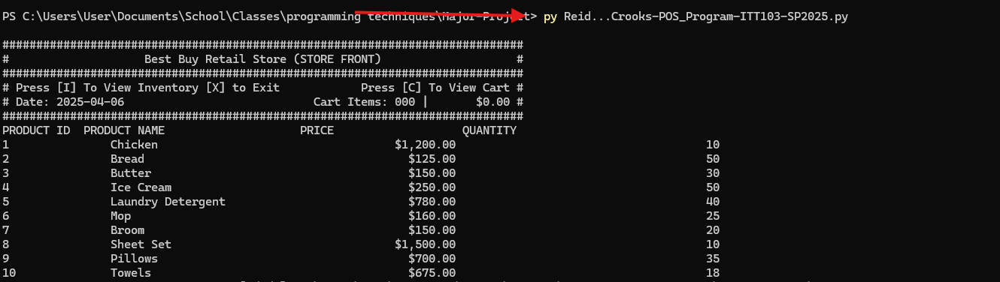

# Store_Pos
This is a grocery CLI store pos system that i written in python. 
The program was created to make it a little easier at check out and to help manage inventory. 

## How to run
- To run the progra open your computer terminal

- "cd" to the directory that has the the store_pos file 

- run the program by calling "py" then type the name of the python file then pre enter

The Authors are: Fahim Crooks and and Melodia Reid 

## Functionality
- Allow you to add item to a cart
- Allow you to remove items from a cart
- Applies discount to purchases more that 5,000 dollars

#### Created date: 04/02/2025
#### Authors: Fahim Crooks and Melodia Reid
#### Course: ITT103 
#### Github public url: https://github.com/Reid-Crooks/Store_Pos.git
