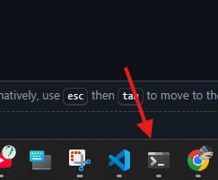
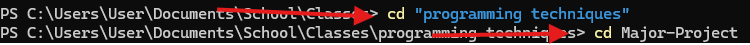

# Store_Pos
This is a grocery CLI store pos system that i written in python. 
The program was created to make it a little easier at check out and to help manage inventory. 

## How to run
- To run the progra open your computer terminal
 

 
- "cd" to the directory that haS the the store_pos file and then type py store_pos.py
 

 
The Authors are: Fahim Crooks and and Melodia Reid 

##Functionality
- Allow you to add item to a cart
- Allow you to remove items from a cart
- Applies discount to purchases more that 5,000 dollars

#### Created date: 04/02/2025
#### Course: ITT103 
#### Github public url: 
